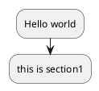
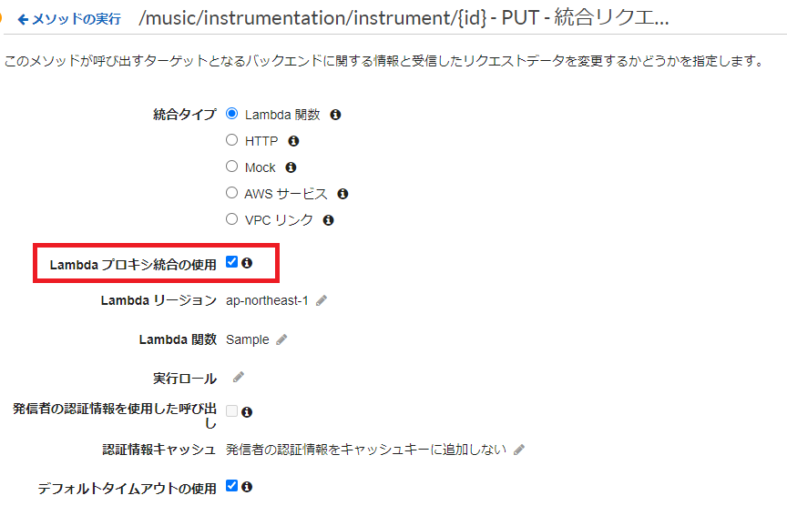

# music-pf-backend
音楽プラットフォームのバックエンド用リポジトリ

# バックエンド環境の全体構成

* MusicPFのバックエンド環境は、AWSを利用して稼働する
* 以下に構成を記載する (記載中)

<!--

-->

# API仕様 (API Gateway)

* 置き場：docs/api

  |ファイル名 |APIの用途 |
  |:-- |:-- |
  |music-pf-api_music.yaml |楽曲に関するAPI |

* [Swagger Editor](https://editor.swagger.io/)で開くこと
  * VSCodeの拡張機能で閲覧などでも可
* API仕様のファイルを新規に起こすときは、 `music-pf-api_{APIの分類}.yaml` のファイル名にすること
  * 後述するAPI Gatewayに対応した各API仕様ファイル出力のため
* AWSのAPI GatewayがSwaggerのインポートをサポートしている
  * パス等にアンダースコアが含まれるとインポートできない。そのため、APIはcamelCaseで定義することとする。
  * Swagger表記の一部記法が存在するとAPI Gatewayにインポートできない。以下の手順に基づきインポートすること。
    1. export_awsgateway.shを /docs/api 上で実行する
    1. API Gatewayに対応した各API仕様ファイルが出力される (プレフィックス `aws-apigateway_` が付く)
    1. AWS GatewayのAPI作成時に、出力したAPI仕様ファイルをインポートする
  * APIインポート後、統合リクエスト設定より「Lambda プロキシ統合の使用」のチェックボックスにチェックを入れること。
    
  * 生成されたインポート用ファイルはGit管理しないこと（.gitignore登録済み）

# 内部処理 (AWS Lambda)

* 置き場：src/MusicPF4AWSLambda
  * MusicPF4AWSLambdaソリューションによって定義する
* Lambda関数のI/Fは以下フォーマットを使用すること
```csharp
using Amazon.Lambda.APIGatewayEvents;
using Amazon.Lambda.Core;
using MusicPF4AWSLambda.Resources;
using System.Net;
using System.Text.Json;
using System.Text.Json.Serialization;

// Assembly attribute to enable the Lambda function's JSON input to be converted into a .NET class.
[assembly: LambdaSerializer(typeof(Amazon.Lambda.Serialization.SystemTextJson.DefaultLambdaJsonSerializer))]

namespace MusicPF4AWSLambda;

public class FunctionSample
{
    /// <summary>
    /// A simple function that takes a string and does a ToUpper
    /// </summary>
    /// <param name="input"></param>
    /// <param name="context"></param>
    /// <returns></returns>
    public APIGatewayProxyResponse FunctionHandler(Request request, ILambdaContext context)
    {
        // 各インプットの参照
        Console.WriteLine("resource:" + request.Resource);
        Console.WriteLine("path:" + request.Path);
        Console.WriteLine("httpMethod:" + request.HttpMethod);
        Console.WriteLine("headers:" + request.Headers.ToString());
        Console.WriteLine("multiValueHeaders:" + request.MultiValueHeaders.ToString());
        Console.WriteLine("queryStringParameters:" + request.QueryStringParameters);
        Console.WriteLine("multiValueQueryStringParameters:" + request.MultiValueQueryStringParameters);
        Console.WriteLine("pathParameters:" + request.PathParameters);
        Console.WriteLine("stageVariables:" + request.StageVariables);
        Console.WriteLine("requestContext:" + request.RequestContext);
        Console.WriteLine("body:" + request.Body);
        Console.WriteLine("isBase64Encoded:" + request.IsBase64Encoded);

        // 処理を記載する

        // 出力
        return new APIGatewayProxyResponse
        {
            StatusCode = (int)HttpStatusCode.OK,
            Body = JsonSerializer.Serialize(new object())
        };
    }
}
```

# データベース (DynamoDB)

* 置き場：docs/database

|ファイル名 |説明 |
|:-- |:-- |
|music-pf-database_music.pu |楽曲に関するDB構成 |
